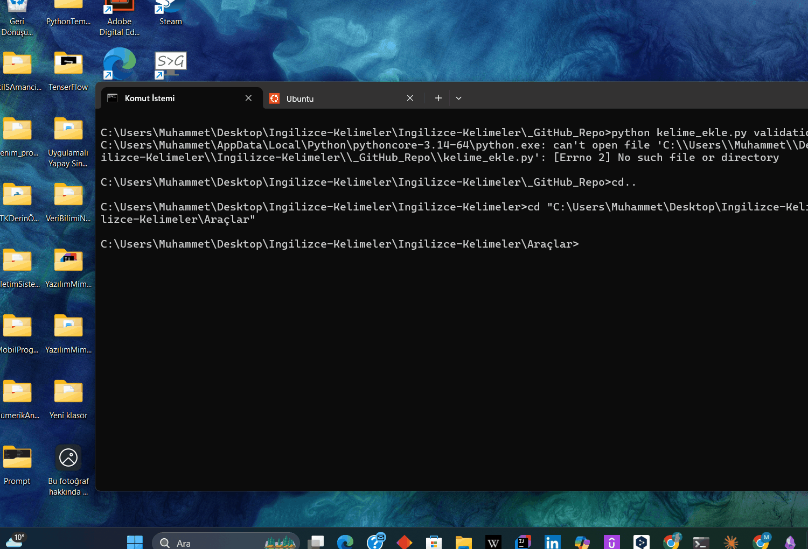

# Ingilizce-Kelimeler — Obsidian için Otomatik İngilizce Kelime Kartları

> [Obsidian](https://obsidian.md) tabanlı bir İngilizce kelime öğrenme sistemi. Sen sadece kelimeyi yazıyorsun, bir Python scripti internetten IPA, tür, tanım, örnek cümle, eş/zıt anlamlıları ve **Türkçe çevirileri** çekip Obsidian'a tertemiz bir kelime kartı yazıyor — spaced repetition ile tekrar etmeye hazır.

🇬🇧 **[English README here](README.md)**



> *(Bu GIF'i kendin kaydedip değiştir — [docs/RECORDING.md](docs/RECORDING.md) içinde 5 dakikalık rehber var.)*

---

## Niye yaptım

Piyasada bir sürü flashcard uygulaması var ama şu özellikleri bir arada bulamadım:

- Gerçek sözlüklerden veri çeken (elden yazmıyorsun)
- Türkçe çevirileri otomatik ekleyen
- Notlar Obsidian'da yaşıyor — verin senin
- Tamamen ücretsiz, API anahtarı gerektirmeyen
- Kelime başına ~2 saniye

Kendim için yaptım. Sana da yarar dokunursa bonus.

## Nasıl çalışıyor

cmd'de yazıyorsun:

```bash
python kelime_ekle.py resilient
```

Obsidian vault'una `resilient.md` notu otomatik düşüyor. İçinde IPA, tür, Türkçe + İngilizce anlam, iki örnek cümle (her biri için Türkçe çeviri), eş/zıt anlamlılar, Spaced Repetition kartı — hepsi dolu.

3 ücretsiz API kullanıyor:

1. **[dictionaryapi.dev](https://dictionaryapi.dev)** — IPA, tür, tanım, örnek, eş/zıt anlamlı (Wiktionary tabanlı)
2. **[MyMemory](https://mymemory.translated.net)** — Türkçe çeviri (kelime + örnek cümleler)
3. **[Tatoeba.org](https://tatoeba.org)** — sözlükte örnek yoksa devreye giriyor; üstelik Türkçe çevirisi insan-yapımı olarak geliyor

API anahtarı yok. `pip install` yok. Sadece Python 3.8+ ve internet bağlantısı.

## Hızlı başlangıç

### 1. İndir

```bash
git clone https://github.com/<kullanici-adin>/ingilizce-kelimeler.git
cd ingilizce-kelimeler
```

Veya bu klasörü doğrudan Obsidian'da vault olarak aç.

### 2. Kelime ekle

```bash
cd "Araçlar"
python kelime_ekle.py resilient
```

Bu kadar. Obsidian'ı aç, `Kelimeler/` klasöründe kart hazır.

### 3. Daha fazla seçenek

```bash
# Birden fazla kelime
python kelime_ekle.py endeavor ubiquitous meticulous

# Liste dosyasından (yeni_kelimeler.txt'ye satır satır yaz)
python kelime_ekle.py

# Farklı seviye
python kelime_ekle.py validation --seviye advanced

# Var olan kelimeyi yenile
python kelime_ekle.py guidance --overwrite

# Türkçe çeviriyi atla
python kelime_ekle.py paradigm --no-translate
```

## Diğer araçlar

Bu repo şunları da içeriyor:

- **`toplu_ekleme.py`** — anlamı zaten yazılı bir CSV'den toplu ekleme
- **`eklentileri_kur.ps1` / `.bat`** — 8 faydalı Obsidian community eklentisini tek tıkla kuran script (Dataview, Templater, Translate, Calendar, Periodic Notes, Excalidraw, Various Complements, Obsidian to Anki). Sadece Windows. Her eklentiyi resmi GitHub release'inden indirir.
- **Obsidian şablonları** — `Templates/Şablon - Basit/Orta/Detaylı.md` üç farklı seviye için
- **Spaced Repetition uyumlu** — her kart `#flashcards/english` etiketi ve `::` ayraçlarıyla geliyor; [obsidian-spaced-repetition](https://github.com/st3v3nmw/obsidian-spaced-repetition) eklentisi otomatik tanır

## Başka diller için

Script varsayılan olarak Türkçe çeviri yapıyor. Başka bir dile çevirmek için `Araçlar/kelime_ekle.py` içindeki şu iki satırı değiştir:

```python
TRANSLATE_API = "https://api.mymemory.translated.net/get?q={q}&langpair=en|tr"
TATOEBA_API = "https://tatoeba.org/en/api_v0/search?from=eng&to=tur&query={q}&sort=relevance"
```

`tr` yerine `es` (İspanyolca), `de` (Almanca), `fr` (Fransızca) yaz. Tatoeba 3-harfli kod istiyor — `tur` yerine `spa`, `deu`, `fra` gibi.

Markdown şablonundaki Türkçe etiketler (Telaffuz, Anlam, vs.) `render_md` fonksiyonunda — orayı da çevirmen lazım.

## Klasör yapısı

```
.
├── README.md                      # İngilizce
├── README.tr.md                   # bu dosya
├── LICENSE                        # MIT
├── Templates/
│   ├── Şablon - Basit.md          # başlangıç şablonu
│   ├── Şablon - Orta.md           # orta (varsayılan)
│   └── Şablon - Detaylı.md        # ileri
├── Araçlar/
│   ├── kelime_ekle.py             # ⭐ ana otomatik script
│   ├── toplu_ekleme.py            # CSV toplu ekleme
│   ├── yeni_kelimeler.txt         # kelime listesi (satır satır)
│   ├── eklentileri_kur.ps1        # eklenti kurucu
│   ├── eklentileri_kur.bat        # çift tıklayıp çalıştır
│   └── README - Toplu Ekleme.md   # araç rehberi
├── Kelimeler/
│   ├── resilient.md               # örnek çıktı
│   ├── endeavor.md
│   └── ubiquitous.md
└── docs/
    ├── RECORDING.md               # demo GIF nasıl kaydedilir
    └── LINKEDIN_POST.md           # paylaşım taslakları
```

## Sınırlar

- **İnternet gerekli.** Şu an offline modu yok. Wiktionary dump'ı entegre edilebilir, henüz değil.
- **MyMemory günlük kotası.** ~5000 kelime/gün. Kişisel kullanımda asla aşmazsın; aşarsan çeviriler boş döner, gece yarısı UTC sıfırlanır.
- **dictionaryapi.dev kapsam boşlukları.** Bazı teknik kelimeler 404 dönebiliyor. Script "bulunamadı" der, elden ekleyebilirsin.
- **Eklenti kurucu Windows'a özel.** `eklentileri_kur.ps1` PowerShell. Mac/Linux kullanıcısı eklentileri Obsidian içinden Settings → Community Plugins'ten kurar.

## Katkıda bulunma

PR'lar açık. Başka bir dil çifti için (İspanyolca öğrenenler, Almanca öğrenenler...) fork açıp adapte ederseniz README'den linkleyeyim memnuniyetle. Ayrıntı [CONTRIBUTING.md](CONTRIBUTING.md) içinde.

## Lisans

MIT — istediğini yap, sadece copyright satırını koru.

## Teşekkürler

- [dictionaryapi.dev](https://dictionaryapi.dev) — Wiktionary tabanlı ücretsiz sözlük API'si
- [MyMemory](https://mymemory.translated.net) — Translated.net'in çeviri belleği
- [Tatoeba](https://tatoeba.org) — topluluk-yapımı çift dilli cümle veritabanı
- [Obsidian](https://obsidian.md) — bütün bunların oturduğu bilgi tabanı

Yapan: [Muhammet Ay](https://github.com/<kullanici-adin>) — İngilizce'yi zor yoldan öğrenirken.
